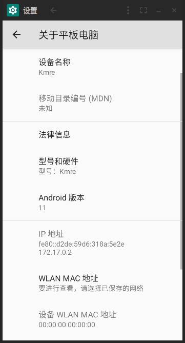
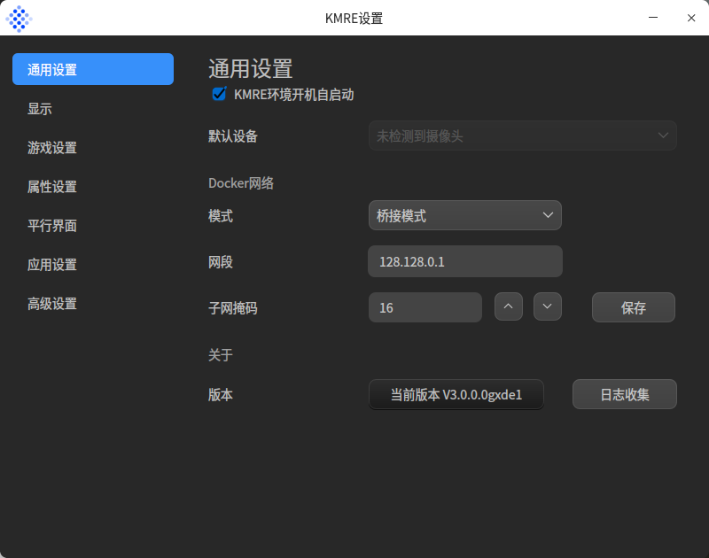
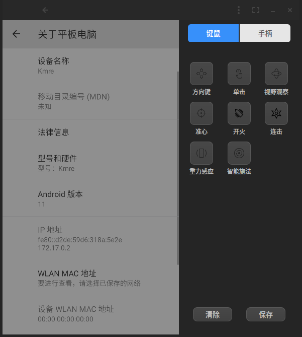
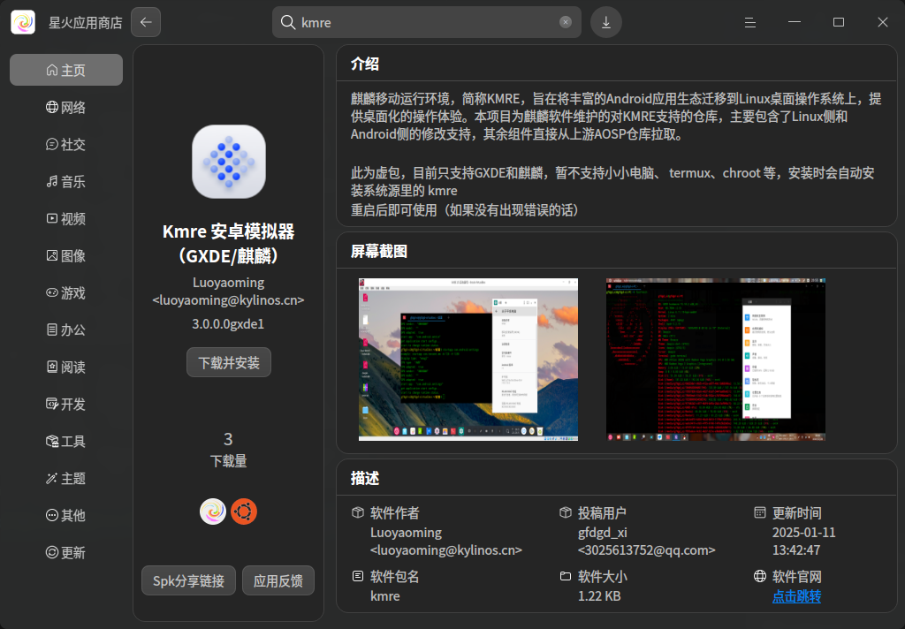

#  <center> KMRE

## 引言
麒麟移动运行环境，简称KMRE，旨在将丰富的Android应用生态迁移到Linux桌面操作系统上，提供桌面化的操作体验。本项目为麒麟软件维护的对KMRE支持的仓库，主要包含了Linux侧和Android侧的修改支持，其余组件直接从上游AOSP仓库拉取。  
相比于原版的 Kmre，该 Kmre 已支持 GXDE OS/Debian，同时做出了一些改进，包括但不限于：  
- 支持 GXDE OS 以及其他基于 Debian 12 的 Linux 发行版（默认内核或 GXDE 内核，自行编译内核需开启 binder 相关选项并合并此 patch：https://gitee.com/GXDE-OS/gxde-kernel/blob/master/patch/export-symbols-needed-by-android-drivers.patch）  
- 新增支持获取 DDE/KDE 缩放比例，不再仅 UKUI 可用  
- 生成的 .desktop文件添加X-GXDE-KMREAPP=true、X-GXDE-KMRE-PKGNAME标签以支持一键卸载安卓应用  
- 生成的 .desktop 添加 gxme 前缀 ，避免出现与 UOS 标准包名撞车  
- 支持通过 CLI 安装或卸载 apk 应用，并定义相应的返回值方便 deb 打包  
- 支持双击 apk 一键安装应用  
- 将 Arm 翻译层更换为 libhoudini，提升应用兼容性
- 接入 GXDE 构建系统

  
  
  

### 提示
1. 你可以安装微软桌面或者其它 Android Launcher 以获得更好的体验  
  
2. 暂只支持 amd64、arm64，不支持龙芯

## 如何在 GXDE OS 安装 Kmre？
> 提示：安装完成后需要重启才可使用  
在终端输入以下命令即可安装：  
```bash
sudo apt update
sudo apt install kmre
```
或者在星火应用商店一键安装  
  

## 如何在自己的发行版构建 Kmre？
> 注意：当前只支持 Debian 系
运行当前仓库下的 `build-kmre-deb.sh` 脚本，即可自动拉取源码构建、安装 Kmre  


## 其余子仓库
https://gitee.com/GXDE-OS/kmre  
https://gitee.com/GXDE-OS/kylin-kmre-window  
https://gitee.com/GXDE-OS/kylin-kmre-manager  
https://gitee.com/GXDE-OS/kylin-kmre-emugl  
https://gitee.com/GXDE-OS/kylin-kmre-apk-installer  
https://gitee.com/GXDE-OS/kylin-kmre-display-control  
https://gitee.com/GXDE-OS/kylin-kmre-daemon  
https://gitee.com/GXDE-OS/kylin-kmre-modules-dkms  
https://gitee.com/GXDE-OS/libkylin-kmre  
https://gitee.com/GXDE-OS/kylin-kmre-image-data-x64  